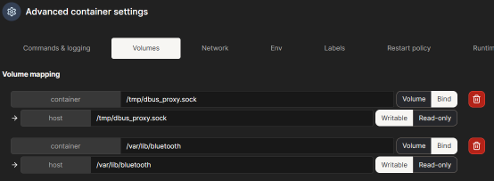
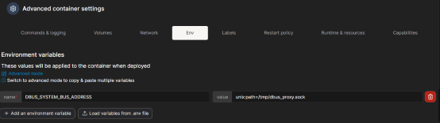
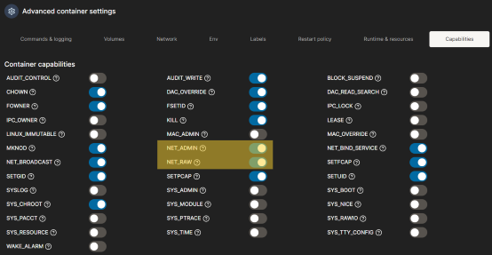

#  Host Bluetooth Integration for Home Assistant in LXC

[](https://www.proxmox.com)
[](https://www.home-assistant.io)
[](LICENSE)

##  Features

Expose your host's Bluetooth stack to a Home Assistant container running inside LXC. This setup enables full access to BLE sensors, pairing, scanning, and device management—without privileged access or hardware passthrough.

- Full access to host Bluetooth via DBus-Broker
- Compatible with Home Assistant Docker or native installs
- Works with BLE sensors, presence tracking, and pairing
- No need for privileged containers or USB passthrough

### Bluetooth Audio through PipeWire A2DP

Not fully tested yet on my setup, as my Bluetooth adapter doesn't support A2DP, but I will also include guidance on how to set up Bluetooth audio streaming through PipeWire. This would allow you to use Bluetooth speakers for media playback from Home Assistant or other services running in the container. Home Assistant DOES NOT support Bluetooth audio, but Music Assistant can be used with PipeWire + RTP streaming to achieve this functionality.

---

### Preface

I wanted to add Bluetooth to my much-neglected Home Assistant setup. I'm running Proxmox on a laptop with insufficient resources, but like 5w-10w peak power consumption. It has no wired network connection, just integrated wireless combo WiFi & Bluetooth, and integrated graphics capable of H265 encoding and decoding. It's just fine for HA, a Jellyfin media server, and a few other basic services.

Regardless, as I was searching for how to connect the Bluetooth from the host, I found not many people had a solution, no solution worked for an LXC container, and most people said it was impossible to do in such a setup. The number one solution was to buy an ESP32 and use that as a Bluetooth relay. Short story, long... I hammered out a fairly simple solution and wrote it up for others to use.

Recently, [jaysoffian](https://github.com/jaysoffian) shared his input for refining and simplifying the setup, and I have incorporated his suggestions into this guide. Thanks, jaysoffian!

I also encountered new issues likely due to Proxmox moving to Kernel 7.x or changes in the Debian lxc template. The solutions are updated in the instructions below.


---
### My Setup

```
    Proxmox Host    
    ├── LXC Container: Home Assistant    
    │   ├── Docker: homeassistant/home-assistant    
    │   ├── Docker: Music Assistant    
    │   ├── Docker: Mosquitto (MQTT)    
    │   └── Docker: Matter Server    
    ├── LXC Container: Jellyfin    
    └── LXC Container: other server...    
```

- **Proxmox Host**: Manages all containers and hardware resources
- **Home Assistant LXC**: Runs Dockerized Home Assistant and supporting services
- **Music Assistant**: Manages music playback and integration (with potential support for Bluetooth audio)
- **Matter Server**: Provides support for Matter-compatible devices through Bluetooth
- **Mosquitto (MQTT)**: Facilitates communication MQTT services

---

### Frequently Asked Questions (not really, but let's just say they are...)

Q: Wouldn't this be easier to just use a VM?    
A: Yes, probably. However, on my machine, resources are limited.    

Q: Why not just pass the USB device through Proxmox?    
A: Because it's an LXC container and not a VM.    

Q: How do you handle the USB address changing on reboot or unplugging/replugging the bluetooth adapter?   
A: I don't have to, unlike other setups, that's not a concern.    

---

#  Setup Instructions

## 1. Proxy D-Bus System Socket

This allows the container to access the host's D-Bus system bus, which is necessary for Bluetooth management. On the host, install necessary packages:

```shell
apt update
apt install -y bluetooth bluez dbus-broker
```

I previously used `/tmp` for the proxy socket, but I found this no longer works. I switched to `/mnt` which is more persistent and less likely to be cleaned up. This was not an issue originally, but Kernel 7.x and/or changes in the Debian LXC template may have introduced changes to the cleanup processes that affect `/tmp`.

I am now using `/mnt` since I already use a recursive mount as part of my automount scripts, but you can use any directory that is not cleaned up on reboot. (my [automount script](https://github.com/Kryxan/automount-pve) has since been merged with [theyo-tester's](https://github.com/theyo-tester/automount-pve) version)

### Create systemd service `/etc/systemd/system/dbus-proxy.service`:

```ini
# /etc/systemd/system/dbus-proxy.service
[Unit]
Description=D-Bus proxy for HA Bluetooth
After=bluetooth.service

[Service]
ExecStartPre=/bin/rm -f /mnt/ha_dbus_proxy.sock
ExecStart=/usr/bin/socat UNIX-LISTEN:/mnt/ha_dbus_proxy.sock,fork,reuseaddr,mode=0666 UNIX-CONNECT:/run/dbus/system_bus_socket
Restart=always

[Install]
WantedBy=multi-user.target
```

### Enable and start:

```shell
systemctl daemon-reexec
systemctl enable --now dbus-proxy
```


### Verify:

- `ss -lx | grep ha_dbus_proxy` → should show LISTEN

---

## (Optional) Verify Bluetooth A2DP Functionality on Host

This step is crucial to confirm that your Bluetooth adapter supports the necessary profiles for audio.
MY adapter does not support A2DP, so I cannot test this step, but I will include the instructions for completeness. If your adapter does not support A2DP, you can still use Bluetooth for presence tracking and BLE sensors, but you won't be able to use Bluetooth audio streaming. I appreciate any feedback from users who have tested this step with a compatible adapter.

```shell
bluetoothctl show
```
Look for the "SupportedUUIDs" section. You should see entries for:

### 🎵 **Required** to **receive** audio from a device (i.e. phone)
`Phone → Bluetooth → Host → PipeWire → RTP → Music Assistant`
- **A2DP Source** (phone → adapter audio)
- **Audio Source** older BlueZ name for the same A2DP roles.

### 🔊 **Required** to **send** audio to a device (i.e. Bluetooth speaker)
`Music Assistant → RTP → PipeWire → Bluetooth speaker`
- **A2DP Sink** (adapter → Bluetooth speaker)
- **Audio Sink** older BlueZ name for the same A2DP roles.

### CSR8510 or BCM20702A0 WILL support A2DP
These Bluetooth chips are in a variety of Bluetooth adapters and will work with PipeWire immediately. Other adapters may or may not support A2DP, and may require additional configuration to enable it. If your adapter does not support A2DP, you will not be able to use Bluetooth audio.

### If your adapter supports A2DP, you can proceed with this step. If it does not, skip to the next step.

If your adapter supports A2DP, you will also need to install PipeWire and the necessary Bluetooth audio modules on the host to enable Bluetooth audio streaming. You can do this with the following command:

```bash
apt install pipewire pipewire-pulse wireplumber pipewire-audio pipewire-alsa pipewire-jack pipewire-rtp pipewire-codecs

systemctl enable --user --now pipewire pipewire-pulse wireplumber
systemctl enable --now pipewire.service
systemctl enable --now wireplumber.service

```

Enable BlueZ A2DP Source in `/etc/bluetooth/main.conf`:

```ini
[General]
Enable=Source,Sink,Media,Socket
```

Enable PipeWire RTP sender `/etc/pipewire/pipewire.conf.d/rtp.conf`:

```ini
context.modules = [
  { name = libpipewire-module-rtp-sender
    args = {
      stream.props = {
        node.name = "bt_rtp_stream"
        media.class = "Audio/Source"
      }
      destination.ip = "127.0.0.1"
      destination.port = 49152
      mtu = 1200
    }
  }
]
```

Restart PipeWire:

```bash
systemctl restart bluetooth
systemctl restart --user pipewire
```
Experiment with what works best for you. 

---

## 2. Bind-Mount into LXC Container

You need to allow the container to access the proxy socket and the Bluetooth data directory on the host. This is done by bind-mounting into the container. I use a recursive bind mount because the `/mnt` path could contain other filesystems. For future compatibility, do not mount into a tempfs path like `/run/dbus` or `/tmp`, as those can be cleaned up by the system. Use a more persistent path like `/mnt` or `/var/lib`.

Edit `/etc/pve/lxc/<vmid>.conf`:

Verify that the features line includes nesting and fuse, and add the following lines to bind-mount the proxy socket and Bluetooth data directory:

```ini
features: nesting=1,fuse=1
hostname: homeassistant
...
lxc.mount.auto: proc:rw sys:rw cgroup:rw
lxc.mount.entry: /mnt mnt none rbind,create=dir 0 0
```

\* `lxc.mount.auto: proc:rw sys:rw cgroup:rw` is not completely necessary to allow the container to access the system resources for Bluetooth management. `nesting=1` and `fuse=1` are more important, however, your setup can differ. Not every setup requires these options, you can experiment with what works best for you. `rbind` is only because I use a recursive mount for my automount scripts, but you can use a non-recursive bind mount if you are not using a path used by other filesystems. The key point is to ensure that the container has access to the proxy socket. 

---

## 3. Configure Container

### Inside LXC: `/etc/systemd/system/dbus-proxy-link.service`:

Create Symlink Service Inside LXC
- Fixes `/run` and `/tmp` cleanup timing
- This links the proxy socket into the system D-Bus location.

```ini
[Unit]
Description=Symlink host D-Bus proxy to system bus socket
After=network.target
Before=docker.service

[Service]
Type=oneshot
ExecStart=/bin/mkdir -p /run/dbus
ExecStart=/bin/ln -sf /mnt/ha_dbus_proxy.sock /run/dbus/system_bus_socket

[Install]
WantedBy=multi-user.target

```

### Enable the Symlink Service

Ensures the D-Bus socket is ready before Docker starts.

```shell
systemctl daemon-reload
systemctl enable --now dbus-proxy-link
```

### Verify: 

Restart LXC and Verify BlueZ Visibility
Confirm the LXC sees the host’s BlueZ over the proxy.

- `pct reboot <ID>` (from host)
- Inside LXC: `busctl tree org.bluez`
- You should now see `/org/bluez/hci0`

> Other potential solution suggested was to use the environment variable below. I am including it, but it does not work for me. However, if you want to try it, add the below line to your LXC configuration. Run the verification part of this step, and if it works for you, then you may not need to set up the systemd service to link the proxy socket.
> `lxc.environment.runtime: DBUS_SYSTEM_BUS_ADDRESS=unix:path=/mnt/dbus_proxy.sock`

---

## 4. Run Home Assistant with Bluetooth Support

### If using Docker from the command line:

```shell
docker run -d \
  --name homeassistant \
  --network host \
  --restart unless-stopped \
  --cap-add NET_ADMIN \
  --cap-add NET_RAW \
  -v /mnt/docker/homeassistant:/config \
  -v /run/dbus/system_bus_socket:/run/dbus/system_bus_socket:ro \
  ghcr.io/home-assistant/home-assistant:stable

docker run -d \
  --name matterserver \
  --network host \
  --restart unless-stopped \
  --cap-add NET_ADMIN \
  --cap-add NET_RAW \
  -v /mnt/docker/matterserver:/data \
  -v /run/dbus/system_bus_socket:/run/dbus/system_bus_socket:ro \
  ghcr.io/home-assistant-libs/python-matter-server:stable

```

### If using Docker Compose:

```yaml
name: homeassistant
services:
  homeassistant:
    image: ghcr.io/home-assistant/home-assistant:stable
    container_name: homeassistant
    network_mode: host
    volumes:
      - /mnt/docker/homeassistant:/config
      - /run/dbus/system_bus_socket:/run/dbus/system_bus_socket:ro
    restart: unless-stopped
    cap_add:
      - NET_ADMIN
      - NET_RAW

  matterserver:
    image: ghcr.io/home-assistant-libs/python-matter-server:stable
    container_name: matterserver
    network_mode: host
    volumes:
      - /mnt/docker/matterserver:/data
      - /run/dbus/system_bus_socket:/run/dbus/system_bus_socket:ro
    restart: unless-stopped
    cap_add:
      - NET_ADMIN
      - NET_RAW

```
\* NET_RAW: Needed for:
- Raw Bluetooth HCI sockets
- Multicast DNS
- SSDP
- ICMP
- Low‑level BLE scanning

\* NET_ADMIN: Needed for:
- Setting Bluetooth socket options
- Joining multicast groups
- Configuring network interfaces for discovery protocols

\* Even though the audio is handled on the host, the Bluetooth control plane (GATT, BLE, Matter commissioning) still requires these capabilities.

### Bluetooth with PipeWire A2DP for Music Assistant:

Again, this is not fully tested on my setup. I provide it so people can test it if they have a compatible adapter, and I will update the instructions as I test it myself or receive feedback from users who have tested it.:

```shell
docker run -d \
  --name musicassistant \
  --network host \
  --restart unless-stopped \
  -v /mnt/docker/musicassistant:/data \
  -v /run/dbus/system_bus_socket:/run/dbus/system_bus_socket:ro \
  ghcr.io/music-assistant/server:latest
```

or with Docker Compose:

```yaml
  musicassistant:
    image: ghcr.io/music-assistant/server:latest
    container_name: musicassistant
    network_mode: host
    volumes:
      - /mnt/docker/musicassistant:/data
      - /run/dbus/system_bus_socket:/run/dbus/system_bus_socket:ro
    restart: unless-stopped
```

\* Music Assistant does not need NET_ADMIN or NET_RAW capabilities, it only needs:
- D‑Bus access (for Bluetooth metadata + AVRCP control)
- RTP audio input (from PipeWire)
- Host networking (for discovery + HA integration)

### If using Portainer:    

Exact current setup not reflected in screenshots, so adjust accordingly, but the key points are:









### In Home Assistant UI:

Bluetooth integration should be available in the Integrations page automatically, but if not:
- Go to Settings → Devices & Services
- Add Bluetooth integration
- Scan and pair devices


### Notes

- Pairing info is stored in /var/lib/bluetooth on the host
- Multiple containers can share the same adapter via separate proxies
- Works with BLE sensors like Xiaomi, Inkbird, and more

### License

This project is licensed under the MIT License.

### Credits

Thank you [jaysoffian](https://github.com/jaysoffian) who shared his input for refining and simplifying the setup. I have incorporated his suggestions into this guide. Thanks, jaysoffian!

Inspired by community efforts to bridge host hardware with containerized automation platforms.

---
